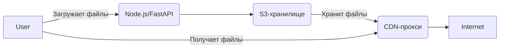

# Подробное руководство по настройке API

1. **Принимает файлы через API** (загрузка/удаление/получение списка).  
2. **Сохраняет их в S3-хранилище (MinIO)**.  
3. **Автоматически генерирует публичные URL**.  
4. **Отслеживает, какие файлы доступны и по каким адресам**.  

---

# 🚀 **Пошаговая инструкция**  

### **1. Архитектура**  


---

### **2. Настройка Docker (`docker-compose.yml`)**  

```yaml
version: '3.8'

services:
  # Хранилище файлов (S3-совместимое)
  minio:
    image: minio/minio
    command: server /data --console-address ":9001"
    volumes:
      - minio_data:/data
    environment:
      MINIO_ROOT_USER: admin      # Логин для MinIO
      MINIO_ROOT_PASSWORD: password123
    ports:
      - "9000:9000"  # S3 API
      - "9001:9001"  # Web UI (управление)

  # CDN и обратный прокси
  traefik:
    image: traefik:v2.10
    command:
      - --api.insecure=true
      - --providers.docker=true
      - --entrypoints.web.address=:80
    ports:
      - "80:80"       # HTTP
      - "8080:8080"   # Dashboard (http://localhost:8080)
    volumes:
      - /var/run/docker.sock:/var/run/docker.sock

  # Бэкенд (FastAPI)
  api:
    build: ./api  # Папка с Dockerfile для API
    environment:
      MINIO_ENDPOINT: minio:9000
      MINIO_ACCESS_KEY: admin
      MINIO_SECRET_KEY: password123
      MINIO_BUCKET: files
    labels:
      - "traefik.http.routers.api.rule=Host(`api.localhost`)"
      - "traefik.http.services.api.loadbalancer.server.port=8000"

volumes:
  minio_data:
```

---

### **3. Настройка API (FastAPI)**  

#### **`./api/Dockerfile`**  
```dockerfile
FROM python:3.9
WORKDIR /app
COPY requirements.txt .
RUN pip install -r requirements.txt
COPY . .
CMD ["uvicorn", "main:app", "--host", "0.0.0.0", "--port", "8000"]
```

#### **`./api/requirements.txt`**  
```
fastapi
uvicorn
python-multipart
minio
```

#### **`./api/main.py`**  
```python
from fastapi import FastAPI, UploadFile, HTTPException
from minio import Minio
from minio.error import S3Error
import uuid

app = FastAPI()

# Подключение к MinIO
minio_client = Minio(
    "minio:9000",
    access_key="admin",
    secret_key="password123",
    secure=False
)

BUCKET = "files"

@app.on_event("startup")
async def startup():
    if not minio_client.bucket_exists(BUCKET):
        minio_client.make_bucket(BUCKET)

@app.post("/upload")
async def upload_file(file: UploadFile):
    file_id = str(uuid.uuid4())
    file_name = f"{file_id}_{file.filename}"
    
    # Загрузка в MinIO
    minio_client.put_object(
        BUCKET, file_name, file.file, file.size
    )
    
    return {
        "url": f"http://localhost/{BUCKET}/{file_name}",
        "file_id": file_id
    }

@app.get("/files")
async def list_files():
    files = []
    for obj in minio_client.list_objects(BUCKET):
        files.append({
            "name": obj.object_name,
            "url": f"http://localhost/{BUCKET}/{obj.object_name}"
        })
    return files
```

---

### **4. Запуск системы**  

```bash
docker-compose up -d
```

- **MinIO UI**: `http://localhost:9001` (логин: `admin`, пароль: `password123`)  
- **Traefik Dashboard**: `http://localhost:8080`  
- **API**: `http://api.localhost`  

---

### **5. Примеры запросов**  

#### **Загрузка файла**  
```bash
curl -X POST -F "file=@test.jpg" http://api.localhost/upload
```
**Ответ**:  
```json
{
  "url": "http://localhost/files/3fa3e3fa-1e2a-4b3c-9d4e-5f6g7h8i9j0k_test.jpg",
  "file_id": "3fa3e3fa-1e2a-4b3c-9d4e-5f6g7h8i9j0k"
}
```

#### **Получение списка файлов**  
```bash
curl http://api.localhost/files
```
**Ответ**:  
```json
[
  {
    "name": "3fa3e3fa-..._test.jpg",
    "url": "http://localhost/files/3fa3e3fa-..._test.jpg"
  }
]
```

#### **Доступ к файлу**  
Откройте в браузере:  
```
http://localhost/files/3fa3e3fa-..._test.jpg
```

---

### **6. Дополнительные улучшения**  

- **HTTPS**: Настройка Let's Encrypt в Traefik ([инструкция](https://doc.traefik.io/traefik/user-guides/docker-compose/acme-http/)).  
- **Авторизация**: Добавьте JWT-токены в API.  
- **Логирование**: Подключите ELK или Grafana Loki.  

---

## **💡 Итог**  
✅ **Файлы загружаются через API** → сохраняются в MinIO.  
✅ **URL генерируются автоматически**.  
✅ **Можно запросить список всех файлов**.  
✅ **Traefik раздаёт файлы как CDN**.  


